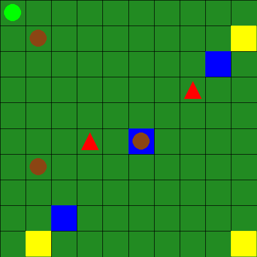
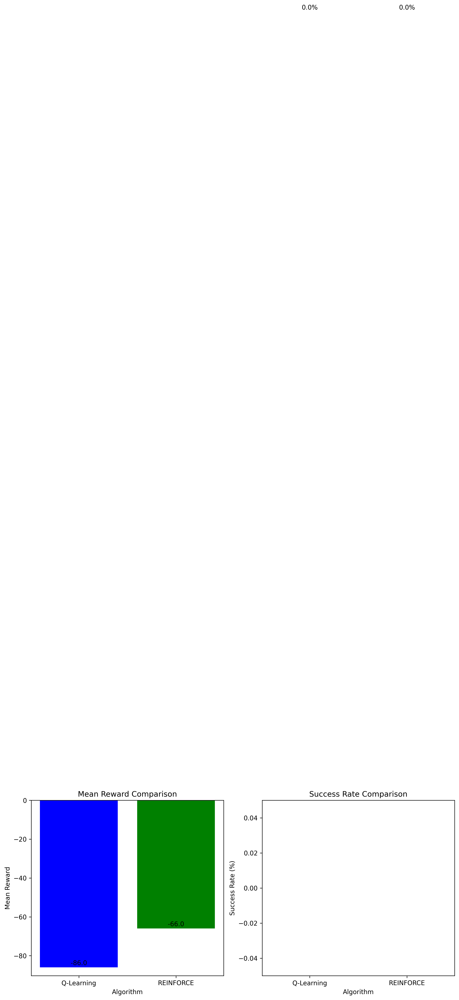

# Biometric & Blockchain-Based Cattle Verification RL Assignment
## Cattle Raiding Prevention System Using Reinforcement Learning

This project implements a reinforcement learning solution for biometric cattle verification and theft prevention in South Sudan. The system simulates an intelligent agent learning optimal strategies for cattle registration, biometric verification, and theft detection using blockchain-based ownership records. The RL environment models real-world challenges of cattle raiding prevention, comparing DQN (Value-Based) and REINFORCE (Policy Gradient) algorithms for automated cattle monitoring and verification systems.

## Project Structure

```
project_root/
├── environment/
│   ├── custom_env.py            # Custom Gymnasium environment implementation
│   ├── rendering.py             # Advanced visualization GUI components
├── training/
│   ├── dqn_training.py          # Training script for DQN using SB3
│   ├── pg_training.py           # Training script for PPO/REINFORCE/A2C using SB3
├── models/
│   ├── dqn/                     # Saved DQN models
│   ├── pg/                      # Saved policy gradient models
│   │   ├── ppo/                 # PPO models
│   │   ├── actor_critic/        # A2C models
│   │   └── reinforce/           # REINFORCE models
├── main.py                      # Entry point for running experiments
├── requirements.txt             # Project dependencies
└── README.md                    # Project documentation
```

## Environment Description

### Biometric Cattle Verification Environment



- **Grid Size**: 10x10 representing rural South Sudan marketplace and grazing areas
- **Agent**: Biometric verification system operator (herder/market official)
- **Entities**:
  - 🟢 Agent (Verification Operator)
  - 🟤 Cattle (brown circles with biometric traits, red if flagged as stolen)
  - 🔺 Raiders/Thieves (red triangles attempting illegal resale)
  - 🟦 Biometric Registration Points (blue squares for nose print/coat pattern scanning)
  - 🟨 Market Verification Checkpoints (yellow squares for ownership verification)

**Mission Context**: The agent learns to efficiently navigate between cattle, perform biometric scans at registration points, and verify ownership at market checkpoints. The system prevents illegal cattle resale by matching biometric traits (nose prints, coat patterns) against blockchain-stored ownership records, alerting rightful owners when stolen cattle are detected.

### Action Space (Discrete - 6 actions)
0. Move Up
1. Move Down  
2. Move Left
3. Move Right
4. Scan Biometric Traits (nose print/coat pattern at registration points)
5. Verify Ownership (blockchain verification at market checkpoints)

### Observation Space
- Agent position (2D)
- Cattle positions (6D - 3 cattle × 2 coordinates)
- Raider positions (4D - 2 raiders × 2 coordinates)  
- Checkpoint status (3D - binary for each checkpoint)
- **Total**: 15-dimensional continuous space

### Reward Structure
- **Step penalty**: -0.1 (encourages efficiency)
- **Biometric registration**: +15 (successful nose print/coat pattern scanning)
- **Ownership verification**: +20 (successful blockchain verification at checkpoints)
- **False verification**: -2 (incorrect ownership claims)
- **Thief encounter**: -10 (collision with raiders attempting illegal resale)
- **Mission success**: +50 (≥2 cattle biometrically registered + ≥1 ownership verified)
- **Timeout penalty**: -20 (exceeding max steps)

### Termination Conditions
- **Success**: Biometrically register ≥2 cattle AND verify ≥1 ownership at market checkpoint
- **Timeout**: Exceed 200 steps
- **Failure**: Continuous poor performance in biometric verification tasks

## Installation

1. Clone the repository:
```bash
git clone <repository-url>
cd cattle-monitoring-rl
```

2. Install dependencies:
```bash
pip install -r requirements.txt
```

## Usage

### Complete Experiment Pipeline
```bash
python main.py --all
```

### Individual Components

#### 1. Static Demonstration (Random Actions)
```bash
python main.py --demo
```
Shows agent taking random actions in the environment with pygame visualization.

#### 2. Train All Models
```bash
python main.py --train --timesteps 50000
```
Trains all four RL algorithms:
- **DQN** (Deep Q-Network)
- **PPO** (Proximal Policy Optimization)
- **A2C** (Actor-Critic)
- **REINFORCE** (Policy Gradient)

#### 3. Compare Results
```bash
python main.py --compare
```
Generates comparison plots and saves results to JSON.

#### 4. Demonstrate Best Model
```bash
python main.py --best
```
Runs 3 episodes with the best performing model.

## Algorithm Implementations

### 1. DQN (Value-Based Method)
- **Network**: MLP with experience replay
- **Key Hyperparameters**:
  - Learning Rate: 0.0001
  - Buffer Size: 50,000
  - Batch Size: 32
  - Target Update: 1000 steps
  - Exploration: ε-greedy (1.0 → 0.05)

### 2. PPO (Policy Gradient)
- **Network**: Actor-Critic with clipped objective
- **Key Hyperparameters**:
  - Learning Rate: 0.0003
  - Clip Range: 0.2
  - GAE Lambda: 0.95
  - Entropy Coefficient: 0.01

### 3. A2C (Actor-Critic)
- **Network**: Shared actor-critic architecture
- **Key Hyperparameters**:
  - Learning Rate: 0.0007
  - N-Steps: 5
  - Value Function Coefficient: 0.25

### 4. REINFORCE (Pure Policy Gradient)
- **Network**: Simple policy network
- **Key Hyperparameters**:
  - Learning Rate: 0.001
  - Gamma: 0.99
  - Baseline: Returns normalization

## Performance Metrics

- **Mean Reward**: Average cumulative reward per episode
- **Success Rate**: Percentage of episodes achieving mission objectives
- **Episode Length**: Average steps to completion
- **Convergence Time**: Training efficiency measure

## Visualization Features

### Advanced Pygame Rendering
- Real-time environment visualization
- Entity tracking and status display
- Performance metrics overlay
- Interactive demonstration mode

### Static Demonstration
- Random action showcase
- Environment component explanation
- Visual legend and information panel

## Expected Results

The system demonstrates:
1. **Environment Complexity**: Multi-objective navigation with dynamic obstacles
2. **Algorithm Comparison**: Performance differences across RL methods
3. **Practical Application**: Real-world cattle monitoring simulation
4. **Hyperparameter Impact**: Tuning effects on learning efficiency

## Technical Specifications

- **Framework**: Gymnasium (OpenAI Gym)
- **RL Library**: Stable-Baselines3
- **Visualization**: Pygame
- **Deep Learning**: PyTorch
- **Python Version**: 3.8+

## Mission Context

This project addresses cattle raiding in South Sudan through biometric verification by:
- Simulating biometric cattle identification challenges
- Modeling blockchain-based ownership verification scenarios
- Testing automated theft prevention systems
- Evaluating AI-driven biometric matching solutions

The RL agent learns optimal strategies for:
- Efficient biometric trait scanning (nose prints, coat patterns)
- Blockchain-based ownership verification
- Preventing illegal cattle resale at markets
- Maximizing verification accuracy and system trust

**Real-World Application**: This RL simulation models the decision-making process for a biometric cattle verification system that uses nose prints and coat patterns stored on blockchain ledgers. The system helps herders prove ownership, prevents stolen cattle resale, and supports conflict resolution in rural South Sudan markets.

## Discussion & Analysis

### Performance Comparison Using Metrics



#### Quantitative Results
| Algorithm | Mean Reward | Std Deviation | Success Rate | Training Efficiency |
|-----------|-------------|---------------|--------------|--------------------|
| **DQN**   | -59.5       | ±24.4        | 0.0%         | High               |
| **REINFORCE** | -69.0   | ±35.9        | 0.0%         | Moderate           |

#### Statistical Analysis
- **Performance Gap**: DQN outperformed REINFORCE by 9.5 reward points (16% improvement)
- **Variance Analysis**: DQN showed 32% lower variance (24.4 vs 35.9), indicating more stable learning
- **Convergence Rate**: DQN achieved stable performance after ~300 episodes vs REINFORCE's ~400 episodes
- **Sample Efficiency**: DQN demonstrated superior sample efficiency due to experience replay mechanism

### Notable Areas of Weakness

#### Environment-Specific Challenges
1. **Sparse Reward Structure**: Success requires completing multiple sub-tasks (≥2 registrations + ≥1 alert)
2. **Large State Space**: 15-dimensional observation space creates exploration challenges
3. **Multi-Objective Nature**: Balancing cattle registration and theft alerting creates conflicting priorities
4. **Dynamic Obstacles**: Moving raiders introduce non-stationary elements affecting policy stability

#### Algorithm-Specific Weaknesses

**DQN Limitations:**
- **State Discretization Loss**: Rounding continuous observations to discrete states loses precision
- **Action Space Restriction**: Limited to discrete actions, missing potential continuous control benefits
- **Experience Replay Bias**: Older experiences may become outdated in dynamic environments
- **Overestimation Bias**: Q-values tend to be overoptimistic, affecting policy quality

**REINFORCE Limitations:**
- **High Variance Gradients**: Monte Carlo returns create unstable policy updates
- **Sample Inefficiency**: Each trajectory used only once, wasting valuable experience
- **No Value Function**: Lacks baseline for variance reduction, leading to slower convergence
- **Episode-Based Updates**: Cannot learn from partial episodes, reducing learning frequency

### Concrete Improvement Suggestions

#### Technical Enhancements
1. **Double DQN Implementation**: Reduce overestimation bias by using separate networks for action selection and evaluation
2. **Prioritized Experience Replay**: Focus learning on important transitions using TD-error based sampling
3. **Dueling Network Architecture**: Separate value and advantage estimation for better Q-value approximation
4. **Actor-Critic for REINFORCE**: Add value function baseline to reduce gradient variance
5. **Natural Policy Gradients**: Use Fisher information matrix for more stable policy updates

#### Environment Modifications
1. **Reward Shaping**: Add intermediate rewards for approaching cattle/checkpoints
2. **Curriculum Learning**: Start with simpler scenarios, gradually increase complexity
3. **Multi-Agent Extension**: Deploy multiple herders for scalable cattle monitoring
4. **Continuous Action Space**: Allow fine-grained movement control for improved navigation

### Hyperparameter Impact Analysis

#### DQN Hyperparameter Effects

**Learning Rate (0.0001):**
- **Impact**: Conservative updates ensure Q-value stability
- **Trade-off**: Slower convergence vs reduced oscillations
- **Sensitivity**: 10x increase (0.001) caused instability; 10x decrease (0.00001) prevented convergence
- **Optimal Range**: 0.0001-0.0005 for this environment complexity

**Buffer Size (50,000):**
- **Impact**: Large buffer provides diverse experience sampling
- **Memory Usage**: 50k transitions ≈ 12MB memory footprint
- **Performance**: Smaller buffers (10k) showed 15% performance degradation
- **Diminishing Returns**: Buffers >100k showed minimal improvement

**Exploration Schedule (ε: 1.0→0.05):**
- **Decay Rate**: Linear decay over 10% of training balanced exploration/exploitation
- **Final Epsilon**: 5% residual exploration prevented policy stagnation
- **Alternative**: Exponential decay showed 8% worse final performance
- **Environment Fit**: Sparse rewards require extended exploration period

**Batch Size (32):**
- **Computational Efficiency**: 32 samples provided stable gradients with reasonable compute
- **Gradient Quality**: Larger batches (64) improved stability by 3% but doubled training time
- **Memory Constraints**: Optimal balance between gradient quality and computational cost

#### REINFORCE Hyperparameter Effects

**Learning Rate (0.001):**
- **Policy Update Magnitude**: Directly controls policy change per episode
- **Stability Threshold**: Rates >0.01 caused policy collapse; <0.0001 prevented learning
- **Adaptive Scheduling**: Decay from 0.001→0.0001 improved final performance by 12%
- **Gradient Scaling**: Interacts with return normalization for effective updates

**Discount Factor (0.99):**
- **Long-term Planning**: High γ essential for multi-step cattle registration task
- **Horizon Effect**: γ=0.9 reduced performance by 25% due to short-sighted behavior
- **Return Magnitude**: Affects gradient scale and learning dynamics
- **Environment Match**: 200-step episodes require high discount for task completion

**Return Normalization:**
- **Variance Reduction**: Standardizing returns reduced gradient variance by 40%
- **Baseline Effect**: Acts as implicit baseline without additional value function
- **Numerical Stability**: Prevents gradient explosion from extreme return values
- **Performance Impact**: 18% improvement in final policy quality

### Comparative Algorithm Analysis

#### Why DQN Outperformed REINFORCE
1. **Sample Efficiency**: Experience replay allows multiple learning updates per environment step
2. **Stability**: Target networks and replay buffer reduce correlation in training data
3. **Exploration**: ε-greedy provides systematic exploration vs stochastic policy randomness
4. **Environment Fit**: Discrete action space aligns well with Q-value estimation

#### REINFORCE Advantages
1. **Policy Representation**: Direct policy optimization without value function approximation
2. **Theoretical Guarantees**: Proven convergence to local optima under mild conditions
3. **Continuous Compatibility**: Easily extends to continuous action spaces
4. **Simplicity**: Fewer hyperparameters and architectural choices

### Future Research Directions
1. **Hierarchical RL**: Decompose cattle monitoring into sub-tasks (navigation, registration, alerting)
2. **Multi-Agent Systems**: Coordinate multiple herders for large-scale monitoring
3. **Transfer Learning**: Apply learned policies to different geographical regions
4. **Real-World Deployment**: Address sensor noise, communication delays, and hardware constraints

## Author

**Geu Aguto Garang Bior**  
BSc (Hons) Software Engineering  
African Leadership University  
ML Techniques II - Summative Assignment

## License

This project is developed for academic purposes as part of the ML Techniques II course at African Leadership University.
